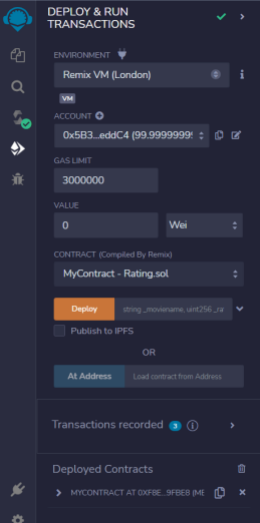
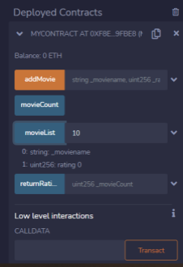
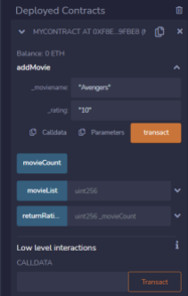
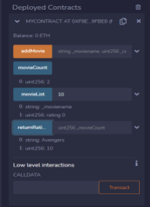
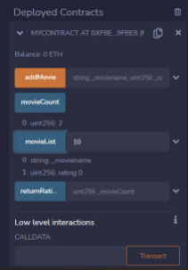

# Blockchain_Technology

# Movie Rating System using smart contract and deployed it using Ethereum. 

Nowadays, Blockchain-based rating/review systems are gaining popularity as a backbone for recommender systems due to the inherent
cryptographically secured decentralised architecture, immutability, user anonymity, and inclusion of smart contracts. So, in this
miniproject a smart contract was written for movie rating system using solidity language and successfully deploy it on Remix IDE with
ethereum. 

# Smart Contract: 
Smart contracts are simply programs stored on a blockchain that run when predetermined conditions are met. They typically are used to automate the execution of an agreement so that all participants can be immediately certain of the outcome, without any intermediary’s involvement or time loss. They can also automate a workflow, triggering the next action when conditions are met. To put it simply the code you write that works on Blockchain is called a smart contract. And to write those codes you have to use Solidity Programming language. 
Process of Build Smart Contract 
1. Coding 
2. Compilation - Used EVM 
3. Deployed - to deploy you should have wallet with Public Private Key Pair & some Ethereum to spend as gas fee. (Remix provide 10
account with 100 Ethereum with each) 

# Tool: Remix IDE
Provide all facilities like smart contract to compilation, deployment, testing interface, etc.

Fig 1.: Deploy Smart Contract Successfully

Fig 2.: Add Movie with its rating 

Fig 3.: Display Movie List

Fig 4.: Display Movies Count 

Fig 5.: Display Movie Name & its Rating 